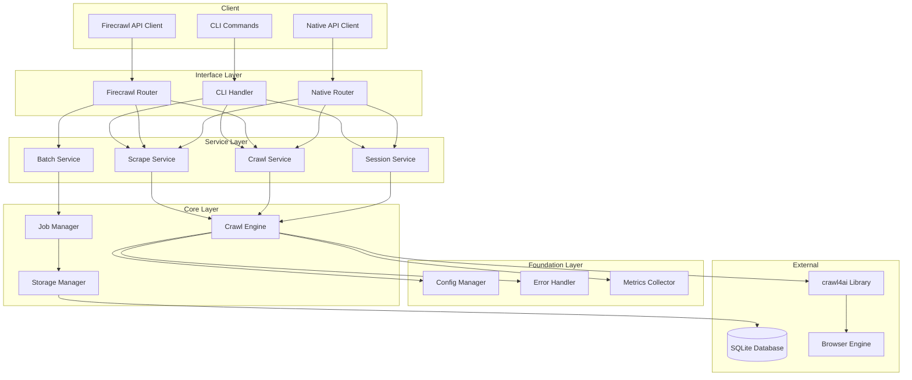
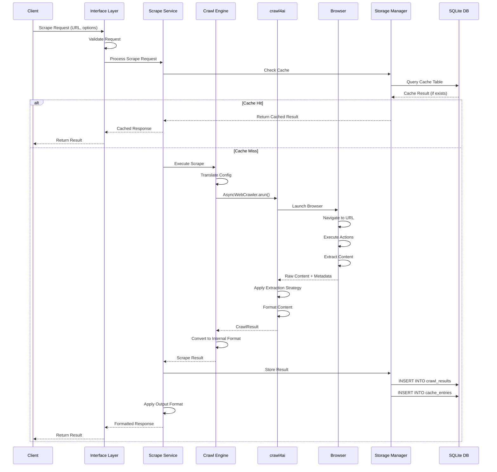
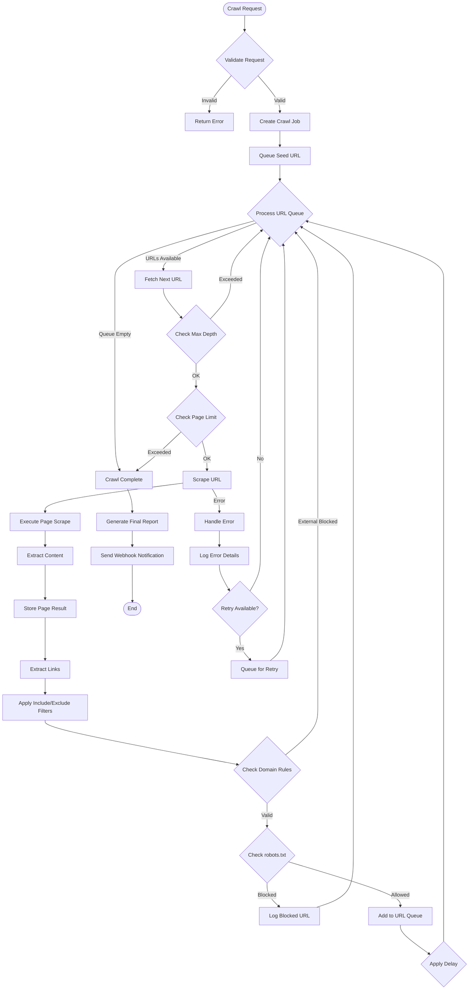
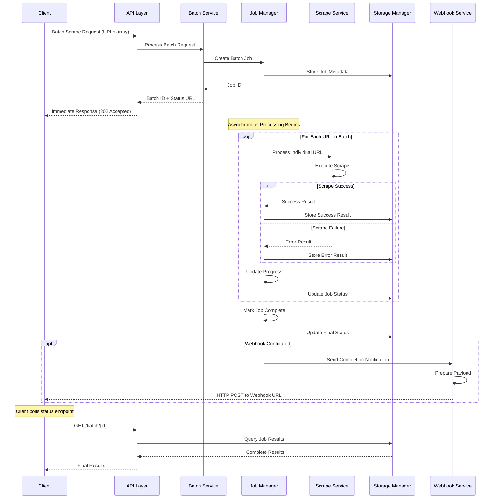
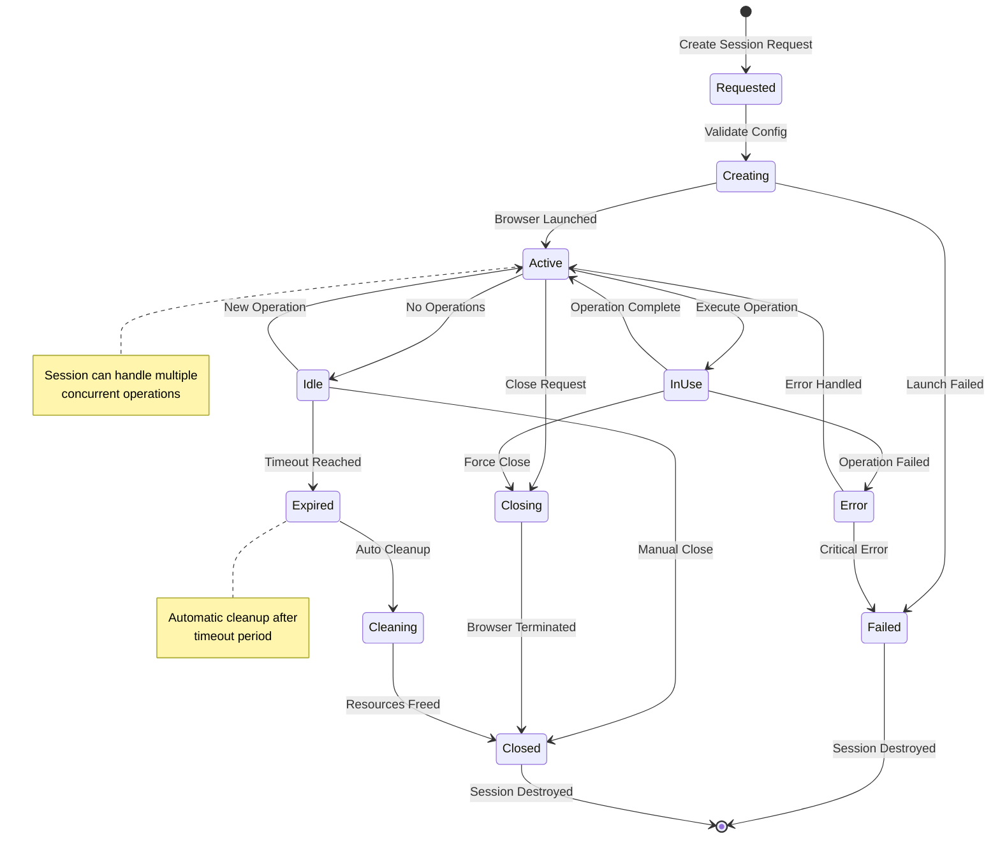
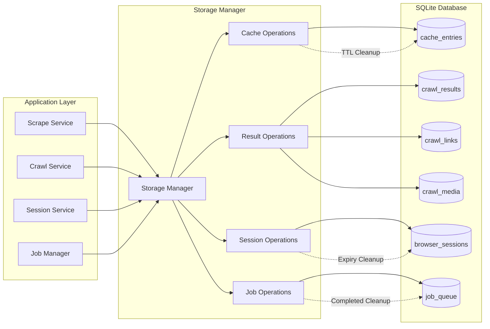
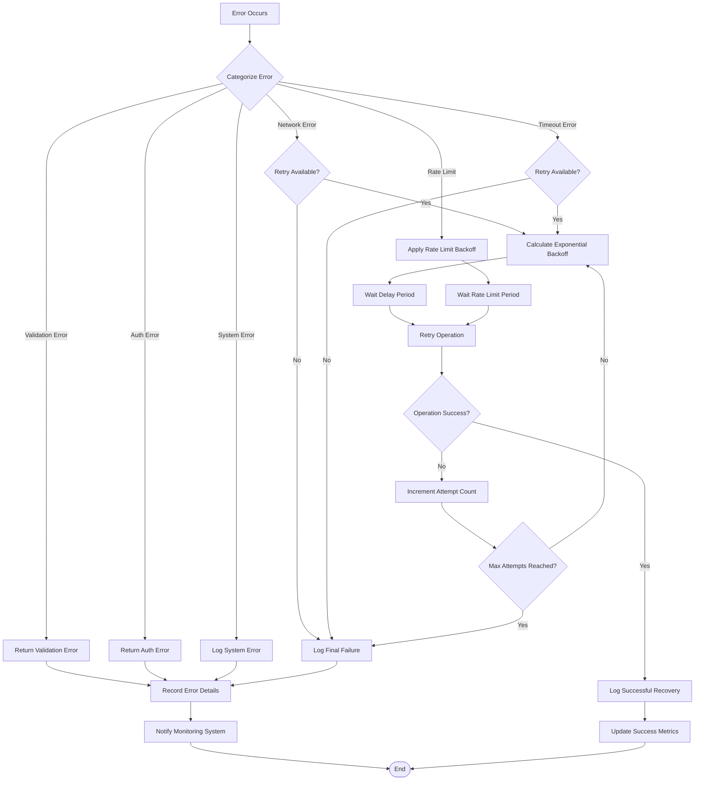

# Crawler System Architecture

## Changelog

| Version | Date | Changes |
|---------|------|---------|
| 1.0.0 | 2025-07-03 | Initial system architecture design with layered architecture and SQLite storage |

## Overview

The Crawler system is a comprehensive web scraping and crawling solution built on top of the crawl4ai library. It provides three distinct interaction methods while maintaining a unified core architecture that leverages all crawl4ai capabilities.

## Groundtruth References

This design is based on the following groundtruth specifications:
- **Crawl4AI Context**: `groundtruth/crawl4ai_context.md` (Generated: 2025-06-16T09:14:43.423Z, Version: 0.6.3)
- **Firecrawl API Specification**: `groundtruth/firecrawl-openapi.json` (OpenAPI 3.0, Version: v1)

*Note: When groundtruth files are updated, this design and implementation must be reviewed and adjusted accordingly.*

## System Goals

- **Complete crawl4ai Integration**: Utilize all crawl4ai features including extraction strategies, browser configurations, session management, and output formats
- **Multi-Interface Support**: Provide CLI (primary), Firecrawl-compatible API (secondary), and native REST API (future) interfaces
- **Scalable Architecture**: Support both single-page scraping and multi-page crawling operations
- **Format Flexibility**: Support all input formats (URLs, files, raw HTML) and output formats (Markdown, JSON, screenshots, PDFs, links, media)
- **Enterprise Ready**: Built for production use with proper error handling, logging, and monitoring

## Implementation Priorities

**Priority Order**: CLI → Firecrawl API → Native API

1. **CLI Interface (HIGHEST PRIORITY)**: Primary interface for immediate use and testing
2. **Firecrawl-Compatible API (HIGH PRIORITY)**: Ensures migration compatibility for existing Firecrawl users
3. **Native REST API (FUTURE PHASE)**: Advanced features and optimal API design for long-term use

## Core Concepts

### Terminology
- **Scrape**: Extract data from a single webpage
- **Crawl**: Navigate and extract data from multiple related webpages starting from a seed URL
- **Session**: Maintain browser state across multiple operations for complex interactions
- **Strategy**: Configurable approach for content extraction (CSS-based, LLM-based, etc.)

## Project Directory Structure

### Overview

The project follows a layered architecture with clear separation of concerns. The directory structure is designed to support the three implementation priorities: CLI (highest), Firecrawl API (high), and Native API (future).

### Root Directory Layout

```
crawler/
├── README.md                    # Project overview and quick start
├── LICENSE                      # Project license
├── pyproject.toml              # Python project configuration (PEP 621)
├── requirements/               # Dependency management
│   ├── base.txt               # Core dependencies
│   ├── dev.txt                # Development dependencies
│   └── prod.txt               # Production dependencies
├── .env.example               # Environment variables template
├── .gitignore                 # Git ignore patterns
├── Dockerfile                 # Container definition
├── docker-compose.yml         # Development environment
├── Makefile                   # Common development tasks
└── crawler.db                 # SQLite database (gitignored)
```

### Source Code Structure

```
src/
└── crawler/                   # Main package
    ├── __init__.py
    ├── __version__.py         # Version information
    ├── main.py               # Application entry point
    │
    ├── cli/                  # CLI Interface Layer (HIGHEST PRIORITY)
    │   ├── __init__.py
    │   ├── main.py          # CLI entry point
    │   ├── commands/        # CLI command modules
    │   │   ├── __init__.py
    │   │   ├── scrape.py    # `crawler scrape` command
    │   │   ├── crawl.py     # `crawler crawl` command
    │   │   ├── batch.py     # `crawler batch` command
    │   │   ├── session.py   # `crawler session` command
    │   │   └── config.py    # `crawler config` command
    │   ├── formatters/      # Output formatting
    │   │   ├── __init__.py
    │   │   ├── json.py
    │   │   ├── markdown.py
    │   │   ├── csv.py
    │   │   └── table.py
    │   └── utils/           # CLI utilities
    │       ├── __init__.py
    │       ├── progress.py  # Progress bars
    │       ├── colors.py    # Terminal colors
    │       └── validation.py # Input validation
    │
    ├── api/                 # API Interface Layer
    │   ├── __init__.py
    │   ├── firecrawl/       # Firecrawl-compatible API (HIGH PRIORITY)
    │   │   ├── __init__.py
    │   │   ├── app.py       # FastAPI application
    │   │   ├── routes/      # API endpoints
    │   │   │   ├── __init__.py
    │   │   │   ├── scrape.py    # /scrape, /batch/scrape
    │   │   │   ├── crawl.py     # /crawl endpoints
    │   │   │   └── extract.py   # /extract endpoint
    │   │   ├── models/      # Pydantic models
    │   │   │   ├── __init__.py
    │   │   │   ├── requests.py  # Request schemas
    │   │   │   ├── responses.py # Response schemas
    │   │   │   └── errors.py    # Error schemas
    │   │   ├── adapters/    # Format conversion
    │   │   │   ├── __init__.py
    │   │   │   ├── request_adapter.py  # Firecrawl → Internal
    │   │   │   └── response_adapter.py # Internal → Firecrawl
    │   │   └── middleware/  # API middleware
    │   │       ├── __init__.py
    │   │       ├── auth.py      # Authentication
    │   │       ├── rate_limit.py # Rate limiting
    │   │       └── cors.py      # CORS handling
    │   │
    │   └── native/          # Native REST API (FUTURE PHASE)
    │       ├── __init__.py
    │       ├── app.py       # FastAPI application
    │       ├── routes/      # RESTful endpoints
    │       │   ├── __init__.py
    │       │   ├── scrape.py    # /v1/scrape/*
    │       │   ├── batch.py     # /v1/batch/*
    │       │   ├── crawl.py     # /v1/crawl/*
    │       │   ├── sessions.py  # /v1/sessions/*
    │       │   ├── config.py    # /v1/config/*
    │       │   └── system.py    # /v1/system/*
    │       ├── models/      # Pydantic models
    │       │   ├── __init__.py
    │       │   ├── scrape.py
    │       │   ├── crawl.py
    │       │   └── common.py
    │       └── middleware/  # API middleware
    │           ├── __init__.py
    │           ├── auth.py
    │           └── validation.py
    │
    ├── services/            # Service Layer
    │   ├── __init__.py
    │   ├── scrape.py        # ScrapeService
    │   ├── crawl.py         # CrawlService
    │   ├── session.py       # SessionService
    │   └── batch.py         # BatchService
    │
    ├── core/                # Core Layer
    │   ├── __init__.py
    │   ├── engine.py        # CrawlEngine (crawl4ai wrapper)
    │   ├── jobs.py          # JobManager
    │   ├── storage.py       # StorageManager (SQLite)
    │   └── actions.py       # Browser actions
    │
    ├── foundation/          # Foundation Layer
    │   ├── __init__.py
    │   ├── config.py        # ConfigManager
    │   ├── errors.py        # ErrorHandler
    │   ├── metrics.py       # MetricsCollector
    │   └── logging.py       # Logging configuration
    │
    ├── models/              # Data Models
    │   ├── __init__.py
    │   ├── scrape.py        # Scrape-related models
    │   ├── crawl.py         # Crawl-related models
    │   ├── session.py       # Session models
    │   ├── config.py        # Configuration models
    │   └── common.py        # Common models
    │
    ├── database/            # SQLite Database Layer
    │   ├── __init__.py
    │   ├── connection.py    # Database connection
    │   ├── migrations/      # Database migrations
    │   │   ├── __init__.py
    │   │   ├── 001_initial.py   # Initial schema
    │   │   ├── 002_sessions.py  # Session tables
    │   │   └── 003_cache.py     # Cache tables
    │   ├── models/          # SQLAlchemy models
    │   │   ├── __init__.py
    │   │   ├── crawl_results.py
    │   │   ├── sessions.py
    │   │   ├── cache.py
    │   │   └── jobs.py
    │   └── repositories/    # Data access layer
    │       ├── __init__.py
    │       ├── base.py      # Base repository
    │       ├── scrape.py    # Scrape repository
    │       ├── crawl.py     # Crawl repository
    │       └── session.py   # Session repository
    │
    ├── utils/               # Utility Functions
    │   ├── __init__.py
    │   ├── validation.py    # Input validation
    │   ├── formatting.py    # Data formatting
    │   ├── conversion.py    # Format conversion
    │   ├── crypto.py        # Cryptographic utilities
    │   ├── network.py       # Network utilities
    │   └── datetime.py      # Date/time utilities
    │
    └── templates/           # Output Templates
        ├── markdown/        # Markdown templates
        │   ├── default.md.j2
        │   ├── news.md.j2
        │   └── ecommerce.md.j2
        ├── html/           # HTML templates
        │   ├── default.html.j2
        │   └── report.html.j2
        └── json/           # JSON templates
            ├── default.json.j2
            └── structured.json.j2
```

### Configuration and Testing Structure

```
config/                        # Configuration files
├── default.yaml              # Default configuration
├── development.yaml          # Development overrides
├── production.yaml           # Production settings
├── profiles/                 # Configuration profiles
│   ├── news.yaml            # News site optimization
│   ├── ecommerce.yaml       # E-commerce optimization
│   └── social.yaml          # Social media optimization
└── schemas/                 # Configuration schemas
    ├── scrape.json          # Scrape config schema
    ├── crawl.json           # Crawl config schema
    └── system.json          # System config schema

tests/                        # Test suite
├── conftest.py              # Pytest configuration
├── fixtures/                # Test fixtures
│   ├── __init__.py
│   ├── sample_pages/        # Sample HTML pages
│   ├── configs/             # Test configurations
│   └── responses/           # Expected responses
├── unit/                    # Unit tests
│   ├── test_cli/           # CLI tests
│   ├── test_services/      # Service layer tests
│   ├── test_core/          # Core layer tests
│   ├── test_api/           # API tests
│   ├── test_database/      # Database tests
│   └── test_utils/         # Utility tests
├── integration/            # Integration tests
├── performance/            # Performance tests
└── compatibility/          # Compatibility tests
```

### Documentation and Deployment Structure

```
docs/                         # Documentation (existing)
├── README.md                # Project overview
├── system-architecture.md   # System architecture
├── development/            # Development guides
├── user-guides/           # User documentation
├── api/                   # API documentation
└── diagrams/              # Architecture diagrams

examples/                     # Usage examples
├── cli/                     # CLI examples
├── api/                     # API examples
├── integrations/           # Integration examples
└── docker/                # Docker examples

scripts/                     # Development and deployment scripts
├── setup/                  # Setup scripts
├── database/               # Database scripts
├── deployment/            # Deployment scripts
├── testing/               # Testing scripts
└── maintenance/           # Maintenance scripts

deploy/                      # Deployment configurations
├── docker/                 # Docker deployment
├── kubernetes/             # Kubernetes deployment
├── helm/                   # Helm charts
└── terraform/             # Infrastructure as code
```

### Directory Structure Rationale

#### 1. **Priority-Driven Organization**
- CLI components are prominently placed in `src/crawler/cli/` for highest priority development
- Firecrawl API in `src/crawler/api/firecrawl/` for high priority implementation
- Native API in `src/crawler/api/native/` clearly marked as future phase

#### 2. **Layer Separation**
- Clear separation between Interface Layer (`cli/`, `api/`), Service Layer (`services/`), Core Layer (`core/`), and Foundation Layer (`foundation/`)
- Each layer has focused responsibilities and minimal coupling

#### 3. **SQLite-First Design**
- Database layer (`database/`) designed around SQLite for Phase 1
- Migration support built-in for future PostgreSQL transition
- Unified storage approach for results, sessions, and cache

#### 4. **Testing Strategy**
- Comprehensive test structure supporting unit, integration, performance, and compatibility testing
- Separate fixtures and test data organization
- Priority on CLI and Firecrawl API compatibility testing

#### 5. **Deployment Ready**
- Docker, Kubernetes, and infrastructure-as-code support from day one
- Environment-specific configuration management
- Production deployment considerations

#### 6. **Development Experience**
- Clear separation of development tools, scripts, and configuration
- Examples and documentation co-located with source code
- Comprehensive tooling for maintenance and operations

## High-Level Architecture

```
┌─────────────────────────────────────────────────────────────────┐
│                     Interface Layer                            │
├─────────────────┬─────────────────┬─────────────────────────────┤
│ CLI Interface   │ Firecrawl API   │  Native REST API            │
│ (PRIMARY)       │ (SECONDARY)     │  (FUTURE)                   │
│                 │                 │                             │
│ • scrape cmd    │ • /scrape       │ • /v1/scrape/single         │
│ • crawl cmd     │ • /crawl        │ • /v1/crawl                 │
│ • batch cmd     │ • /batch/scrape │ • /v1/batch/scrape          │
│ • session mgmt  │ • /extract      │ • /v1/sessions              │
│ • config mgmt   │                 │ • /v1/config                │
└─────────────────┴─────────────────┴─────────────────────────────┘
                              │
┌─────────────────────────────────────────────────────────────────┐
│                  Service Layer                                 │
├─────────────────┬─────────────────┬─────────────────────────────┤
│  Scrape Service │  Crawl Service  │   Session Service           │
│                 │                 │                             │
│ • Single page   │ • Multi-page    │ • Browser sessions          │
│ • Batch scrape  │ • Site crawling │ • State management          │
│ • Format conv   │ • Link discovery│ • Session cleanup           │
└─────────────────┴─────────────────┴─────────────────────────────┘
                              │
┌─────────────────────────────────────────────────────────────────┐
│                    Core Layer                                  │
├─────────────────┬─────────────────┬─────────────────────────────┤
│  Crawl4ai Core  │  Job Management │   Storage & Cache           │
│                 │                 │                             │
│ • AsyncWebCrawl │ • Queue mgmt    │ • Result storage            │
│ • Extraction    │ • Status track  │ • Session persistence       │
│ • Configuration │ • Error handling│ • Cache management          │
└─────────────────┴─────────────────┴─────────────────────────────┘
```

## Component Details

### 1. Interface Layer

#### CLI Interface
- **Command Structure**: `crawler [scrape|crawl] [options]`
- **Configuration**: YAML/JSON config files and command-line arguments
- **Output**: Flexible output formats (JSON, Markdown, files)
- **Features**: Progress bars, verbose logging, batch processing

#### Firecrawl Compatible API
- **Compatibility**: Full compatibility with Firecrawl API specification
- **Endpoints**: Exact match of Firecrawl endpoints and schemas
- **Migration**: Easy migration path from Firecrawl to our system
- **Priority**: HIGH PRIORITY - implemented after CLI

#### Native REST API
- **Design**: RESTful endpoints with clear resource hierarchy
- **Authentication**: API key-based authentication
- **Documentation**: OpenAPI/Swagger documentation
- **Features**: Advanced operations and optimal API design
- **Priority**: FUTURE PHASE - implemented after Firecrawl compatibility

### 2. Service Layer

#### Scrape Service
- **Single Page Operations**: Direct URL scraping with various extraction strategies
- **Batch Operations**: Parallel processing of multiple URLs
- **Format Conversion**: Transform between different output formats
- **Validation**: Input validation and sanitization

#### Crawl Service
- **Multi-Page Crawling**: Intelligent navigation through related pages
- **Link Discovery**: Automatic detection of crawlable links
- **Depth Control**: Configurable crawling depth and scope
- **Filtering**: Include/exclude patterns for URLs and content

#### Session Service
- **Browser Management**: Persistent browser sessions for complex interactions
- **State Tracking**: Maintain state across multiple operations
- **Resource Cleanup**: Automatic cleanup of browser resources
- **Session Pooling**: Efficient reuse of browser instances

### 3. Core Layer

#### Crawl4ai Integration
- **Direct Integration**: Full utilization of crawl4ai's AsyncWebCrawler
- **Configuration Mapping**: Translation between our API and crawl4ai configs
- **Strategy Support**: Support for all crawl4ai extraction strategies
- **Extension Points**: Easy extension for new crawl4ai features

#### Job Management
- **Queue System**: Async job processing with priority support
- **Status Tracking**: Real-time job status and progress tracking
- **Error Handling**: Comprehensive error handling and retry logic
- **Concurrency**: Configurable concurrency limits and resource management

#### Storage & Cache
- **Result Storage**: SQLite-based persistent storage for crawl results (Phase 1)
- **Cache Management**: SQLite-based intelligent caching for improved performance
- **Session Persistence**: SQLite-based durable session state across restarts
- **Cleanup Policies**: Automatic cleanup of old data with SQLite cleanup procedures
- **Migration Path**: Future migration to PostgreSQL for production scale

## Data Flow

### Scrape Operation Flow
```
1. Request → Interface Layer → Validation
2. Validation → Service Layer → Job Creation
3. Job Creation → Core Layer → Crawl4ai Execution
4. Crawl4ai Execution → Result Processing → Format Conversion
5. Format Conversion → Storage → Response
```

### Crawl Operation Flow
```
1. Request → Interface Layer → Validation
2. Validation → Service Layer → Crawl Planning
3. Crawl Planning → Core Layer → Multi-Step Execution
4. Multi-Step Execution → Link Discovery → Queue Management
5. Queue Management → Parallel Processing → Result Aggregation
6. Result Aggregation → Storage → Response
```

## Business Flow Diagrams

### System Request Processing Flow

This diagram shows how requests flow through the three-layer architecture:



### Single Page Scrape Flow

This sequence diagram shows the detailed flow for single page scraping:



### Multi-Page Crawl Flow

This flowchart shows the complex multi-page crawling process:



### Batch Processing Flow

This sequence diagram shows asynchronous batch processing:



### Session Management Lifecycle

This state diagram shows browser session lifecycle:



### SQLite Storage Operations

This diagram shows data flow between services and SQLite storage:



### Error Handling and Retry Logic

This flowchart shows comprehensive error handling:



## Configuration Management

### Configuration Hierarchy
1. **System Defaults**: Built-in sensible defaults
2. **Configuration Files**: YAML/JSON configuration files
3. **Environment Variables**: Environment-based overrides
4. **Command Line Arguments**: Runtime overrides
5. **API Parameters**: Request-specific parameters

### Configuration Categories
- **Browser Configuration**: Headless mode, proxy settings, user agents
- **Extraction Configuration**: Strategies, LLM settings, CSS selectors
- **Performance Configuration**: Concurrency, timeouts, retry policies
- **Output Configuration**: Formats, filtering, transformation rules

## Error Handling Strategy

### Error Categories
1. **Validation Errors**: Invalid input parameters
2. **Network Errors**: Connection issues, timeouts
3. **Extraction Errors**: Failed content extraction
4. **Resource Errors**: Memory, disk space limitations
5. **System Errors**: Internal system failures

### Error Response Format
```json
{
  "success": false,
  "error": {
    "code": "VALIDATION_ERROR",
    "message": "Invalid URL format",
    "details": {
      "field": "url",
      "value": "invalid-url",
      "expected": "Valid HTTP/HTTPS URL"
    }
  },
  "timestamp": "2025-07-03T10:30:00Z",
  "requestId": "req-123456"
}
```

## Security Considerations

### Input Validation
- **URL Validation**: Strict URL format validation
- **Content Filtering**: Protection against malicious content
- **Rate Limiting**: Request rate limiting and throttling
- **Resource Limits**: Memory and CPU usage limits

### Authentication & Authorization
- **API Key Authentication**: Secure API key management
- **Role-Based Access**: Different access levels for different operations
- **Audit Logging**: Comprehensive audit trail

## Performance Optimization

### Caching Strategy
- **Result Caching**: Cache successful scrape results
- **Session Caching**: Reuse browser sessions when possible
- **Configuration Caching**: Cache parsed configurations
- **DNS Caching**: Cache DNS lookups

### Concurrency Management
- **Parallel Processing**: Concurrent execution of independent operations
- **Resource Pooling**: Efficient resource utilization
- **Backpressure Handling**: Graceful handling of high load
- **Queue Management**: Intelligent job queue management

## Monitoring & Observability

### Metrics Collection
- **Performance Metrics**: Response times, throughput, error rates
- **Resource Metrics**: Memory usage, CPU utilization
- **Business Metrics**: Scraping success rates, data quality
- **System Metrics**: Queue sizes, active sessions

### Logging Strategy
- **Structured Logging**: JSON-formatted logs for easy parsing
- **Log Levels**: Configurable log levels (DEBUG, INFO, WARN, ERROR)
- **Context Propagation**: Request tracing across components
- **Log Aggregation**: Centralized log collection and analysis

## Deployment Architecture

### Containerization
- **Docker Support**: Full Docker containerization
- **Multi-Stage Builds**: Optimized container images
- **Health Checks**: Built-in health check endpoints
- **Environment Configuration**: Environment-based configuration

### Scalability
- **Horizontal Scaling**: Support for multiple instances
- **Load Balancing**: Proper load balancing considerations
- **State Management**: Stateless design where possible
- **Resource Sharing**: Efficient resource sharing between instances

## Technology Stack

### Core Dependencies
- **Python 3.9+**: Primary runtime environment
- **crawl4ai**: Core web crawling library (version 0.6.3+)
- **FastAPI**: API framework for REST endpoints
- **Click**: CLI framework
- **Pydantic**: Data validation and serialization
- **SQLite**: Unified database for storage, session management, and caching

### Additional Dependencies
- **Playwright**: Browser automation (via crawl4ai)
- **asyncio**: Asynchronous programming
- **aiohttp**: HTTP client for external requests
- **SQLAlchemy**: Database ORM with SQLite backend
- **Alembic**: Database migrations for SQLite

## Database Architecture Design

### Phase 1: SQLite Strategy
The system uses a unified SQLite approach for Phase 1 implementation:

- **Single Database File**: All data stored in one SQLite database file for simplicity
- **Performance Considerations**: SQLite with WAL mode for concurrent read/write operations
- **Session Management**: Browser sessions stored in SQLite tables with TTL-based cleanup
- **Cache Implementation**: SQLite-based cache with LRU eviction policies
- **Result Storage**: Structured storage of crawl results with JSON fields for flexibility

### Future: PostgreSQL Migration Strategy
- **Production Database**: PostgreSQL for scalable production deployment
- **Data Compatibility**: Maintain compatible data formats for seamless migration
- **Migration Tools**: Automated migration scripts from SQLite to PostgreSQL
- **Zero-Downtime**: Strategies for migrating without service interruption

### SQLite Schema Design
```sql
-- Core tables for unified SQLite storage
CREATE TABLE crawl_results (
    id INTEGER PRIMARY KEY AUTOINCREMENT,
    job_id TEXT,
    url TEXT NOT NULL,
    content_markdown TEXT,
    content_html TEXT,
    extracted_data JSON,
    metadata JSON,
    created_at DATETIME DEFAULT CURRENT_TIMESTAMP,
    updated_at DATETIME DEFAULT CURRENT_TIMESTAMP
);

CREATE TABLE browser_sessions (
    session_id TEXT PRIMARY KEY,
    config JSON,
    state_data JSON,
    created_at DATETIME DEFAULT CURRENT_TIMESTAMP,
    last_accessed DATETIME DEFAULT CURRENT_TIMESTAMP,
    expires_at DATETIME
);

CREATE TABLE cache_entries (
    cache_key TEXT PRIMARY KEY,
    data_value JSON,
    created_at DATETIME DEFAULT CURRENT_TIMESTAMP,
    expires_at DATETIME,
    access_count INTEGER DEFAULT 0
);
```

### Migration Strategy
- **Phase 1**: Start with SQLite for rapid development and deployment
- **Future Phases**: Migrate to PostgreSQL when scale requirements grow
- **Data Compatibility**: Maintain data format compatibility for easy migration
- **No Redis**: Cache remains in SQLite for simplicity

## Development Phases

### Phase 1: CLI Foundation (HIGHEST PRIORITY)
- Implement CLI interface with full crawl4ai integration (version 0.6.3+)
- SQLite backend setup and schema migrations
- Core service layer implementation
- Basic error handling and logging
- Configuration management system

### Phase 2: Firecrawl API Compatibility (HIGH PRIORITY)
- **Firecrawl compatibility layer** (based on `groundtruth/firecrawl-openapi.json`)
- SQLite-based session management
- Authentication system for API
- Async job management with SQLite
- Webhook support for Firecrawl compatibility

### Phase 3: Advanced Features
- Advanced extraction strategies (based on `groundtruth/crawl4ai_context.md`)
- SQLite performance optimization
- Batch operations and parallel processing
- Enhanced CLI features and plugins

### Phase 4: Production Ready & Native API
- Native REST API implementation (FUTURE)
- PostgreSQL migration tools and strategies
- Comprehensive monitoring and observability
- Security hardening
- Documentation completion
- Deployment automation

## Next Steps

1. **CLI Implementation**: Start with CLI interface as primary development focus
2. **SQLite Implementation**: Set up SQLite database schema and connection management
3. **Crawl4AI Integration**: Implement core crawl4ai wrapper based on groundtruth context
4. **Firecrawl API Compatibility**: Implement Firecrawl-compatible API (after CLI)
5. **Data Format Specifications**: Define all input/output formats with SQLite storage
6. **PostgreSQL Migration Planning**: Design migration strategy for future scalability
7. **Native API Planning**: Plan Native REST API for future implementation phases

## References

- **Groundtruth Files**: All implementation decisions should reference and validate against groundtruth specifications
- **Version Tracking**: Monitor groundtruth file changes for design updates
- **Crawl4AI Documentation**: Leverage crawl4ai 0.6.3+ features as documented in groundtruth context
